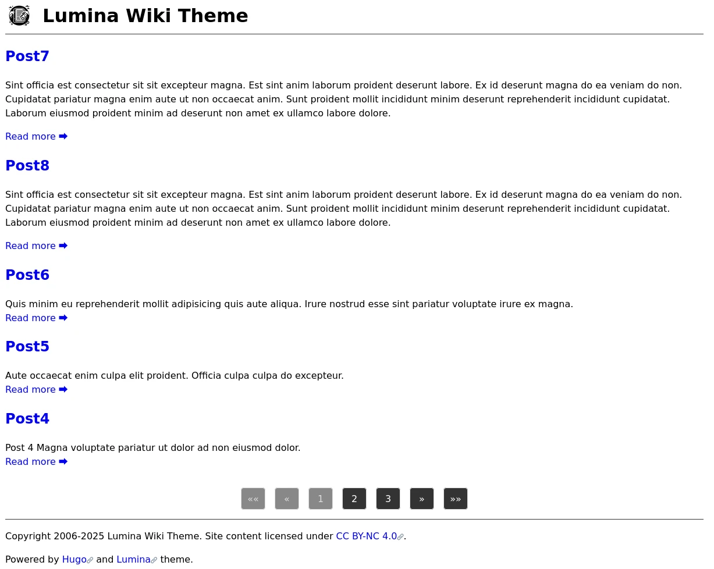

# Lumina

[](https://opensource.org/licenses/isc)
[](https://gohugo.io)

Simplistic wiki-like theme for Hugo

## Features

- **Landing page:** Lists all posts sorted by tags. Posts with multiple tags appear in each relevant tag section.
- A **meta** category with links to "posts" and "tags" is automatically added to the landing page. It's best not use "meta" as a tag for posts, as this would cause the "meta" group to appear twice.
- No menu is displayed.
- The **footer** is automatically generated using the site title and current year. 
- Setting `yearStart` in the `hugo.toml` file adds a starting year to the footer.
- **External links** are marked with 🔗 in both the footer and post content, and open in a new tab or window.
- **Admonitions** can be added using the HTML tags `<note>`, `<warning>`, `<error>` and `<success>`. Note that unsafe content must be allowed - see the *settings* section for details.

## Admonitions

Admonitions can be easily added to posts using simple HTML tags. See the example below:

```html
<note>This is a note</note>
```

Note that admonitions require unsafe content to be enabled. See the *Settings* section for details.

## Screenshots

### Landing page


### Tags page


### Posts page



### Example posts


## Installation

Add the theme files to your themes directory, then enable it in your `hugo.toml` file with:

```toml
theme = 'lumina'
```

## Configuration

### Footer

By default, the footer displays only the current year. However, if you set the `yearStart` parameter in the `hugo.toml` file to your desired starting year, the footer will show a range in the format `yearStart–currentYear` (e.g., `2006–2024`).

```toml
[params]
yearStart = ""
```

### Date format

This setting defines the format used to display dates in your posts.

```toml
[params]
dateFormat = "Jan 2, 2006"
```

### Admonitions

To enable admonitions, include the following snippet in your configuration:

```toml
[markup.goldmark.renderer]
unsafe = true
```

Be aware of the security implications of this setting. Enabling `unsafe` allows raw HTML to be rendered, which can pose a risk if you don’t control all site content — malicious HTML could be injected into posts *before* the site is built. If you manage all the content yourself, this setting is generally safe to use.
